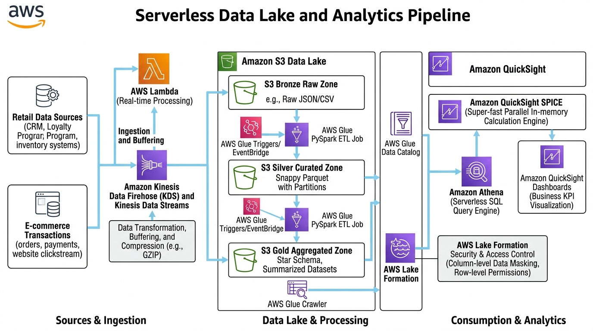

# Serverless Data Lake and Analytics Pipeline with S3, Kinesis Firehose, Glue & Athena

[](https://aws.amazon.com/big-data/datalakes-and-analytics/)
[-blue)](https://aws.amazon.com/athena/)
[](https://aws.amazon.com/lake-formation/)
[](LICENSE)

An enterprise serverless data lake and analytics platform architected on Amazon S3 for high-volume retail transactions. Features streaming ingestion via **Amazon Kinesis Data Firehose**, automated schema discovery and ETL processing using **AWS Glue Data Catalog & Spark ETL jobs**, zero-infrastructure SQL analytics via **Amazon Athena**, fine-grained column-level data masking with **AWS Lake Formation**, and KPI visualization powered by **Amazon QuickSight SPICE**.

---

## Table of Contents

- [Solution Overview](#solution-overview)
- [Architecture Diagram](#architecture-diagram)
- [AWS Services Used & Why](#aws-services-used--why)
- [Three-Zone Data Lake Design (Medallion Architecture)](#three-zone-data-lake-design-medallion-architecture)
- [Design Decisions & Well-Architected Trade-offs](#design-decisions--well-architected-trade-offs)
- [Cost Estimation & Optimization](#cost-estimation--optimization)

---

## Solution Overview

Legacy data warehouses require expensive 24/7 provisioned nodes, suffer from strict proprietary schemas, and struggle to scale when ingesting millions of unstructured or semi-structured JSON records.

This solution implements a serverless Lakehouse pattern:
- **Streaming Ingestion**: Kinesis Data Firehose buffers incoming retail transaction events, applies GZIP compression, and delivers objects to S3 with automated date-based prefixes.
- **Automated Schema Evolution**: AWS Glue Crawlers periodically inspect new partitions, infer schema drift, and update the central Data Catalog.
- **Parquet Columnar Optimization**: AWS Glue converts raw, row-oriented JSON into columnar Apache Parquet with Snappy compression, reducing Amazon Athena scan volumes by over 90% and slashing query costs.
- **Fine-Grained Data Privacy**: AWS Lake Formation enforces column-level security, allowing business analysts to query retail sales while masking Personally Identifiable Information (PII) such as customer emails.

---

## Architecture Diagram




---

## AWS Services Used & Why

| Service | Role in Architecture | Why We Chose This Service |
|---|---|---|
| **Amazon S3** | Medallion Data Lake Storage | Provides virtually unlimited, highly durable (99.999999999%) object storage partitioned into Bronze (raw ingestion), Silver (curated Parquet), and Gold (business KPIs) tiers with automated lifecycle transitions to Glacier for historical archives. |
| **Amazon Kinesis Data Firehose** | Streaming Ingestion & Batching | Serverless streaming ingestion engine that buffers high-throughput streaming events, compresses data into GZIP, and batches writes to S3 with year/month/day prefixing without managing Kafka brokers or consumer EC2 fleets. |
| **AWS Glue Data Catalog & Crawlers** | Metadata Discovery & Schema Store | Automatically crawls raw and curated datasets to infer data schemas and detect schema drift. Provides an Apache Hive-compatible central catalog accessible by Athena, EMR, and Redshift Spectrum. |
| **AWS Glue Spark ETL Jobs** | Serverless Batch Transformation | Executes serverless distributed PySpark transformations. Converts uncompressed row-based JSON into Snappy-compressed columnar Apache Parquet files partitioned by date, optimizing downstream query efficiency. |
| **Amazon Athena** | Serverless Interactive SQL Analytics | Executes standard ANSI SQL queries directly against data stored in S3 with zero infrastructure to provision or manage. Charging only $5.00 per TB scanned, querying columnar Parquet costs pennies. |
| **AWS Lake Formation** | Centralized Data Governance & Security | Enforces fine-grained, column-level security policies (e.g. masking PII columns like customer email or phone numbers) across data lake tables, ensuring compliance with privacy regulations like GDPR and CCPA. |
| **Amazon QuickSight** | Business Intelligence & Dashboards | Provides business executives and analysts with interactive dashboards. The SPICE in-memory engine accelerates visual rendering and shields Athena and S3 from repetitive query costs. |
| **Amazon EventBridge** | Workflow Scheduling | Triggers daily scheduled Glue ETL batch jobs and initiates downstream catalog updates in an automated serverless fashion. |

---

## Three-Zone Data Lake Design (Medallion Architecture)

```text
[ Streaming Ingestion ]
         │
         ▼
┌─────────────────────────────────┐
│   Bronze / Raw Bucket           │ ➔ Immutable, exact copy of source JSON transactions
│   s3://retail-raw-zone/         │ ➔ Retained for 90 days, then transitions to Glacier
└─────────────────────────────────┘
         │ (Glue PySpark ETL: Schema validation, deduplication, Parquet conversion)
         ▼
┌─────────────────────────────────┐
│   Silver / Curated Bucket       │ ➔ Columnar Apache Parquet with Snappy compression
│   s3://retail-curated-zone/     │ ➔ Partitioned: /year=YYYY/month=MM/day=DD/
└─────────────────────────────────┘
         │ (Athena CTAS aggregation queries or Glue scheduled jobs)
         ▼
┌─────────────────────────────────┐
│   Gold / Aggregated Bucket      │ ➔ High-performance business metric rollups
│   s3://retail-aggregated-zone/  │ ➔ Feeds Executive QuickSight SPICE dashboards directly
└─────────────────────────────────┘
```

---

## Design Decisions & Well-Architected Trade-offs

| Component | Architecture Decision | Technical Justification |
|---|---|---|
| **Storage Format** | JSON to Apache Parquet | Athena charges $5.00 per TB scanned. Querying 1TB of raw JSON costs $5.00. Querying the equivalent data in partitioned, columnar Parquet scans only ~80GB, reducing query cost to $0.40 (92% savings) and improving query speed 5x. |
| **Ingestion Engine** | Kinesis Data Firehose | Fully serverless streaming delivery that automatically buffers records into batches, eliminating the operational complexity of managing consumer worker EC2 instances. |
| **Catalog & Crawlers** | AWS Glue Data Catalog | Acts as an Apache Hive-compatible centralized metastore. Queries across Athena, EMR, and Redshift Spectrum query the same schema definition seamlessly. |
| **Security & Governance**| AWS Lake Formation | Native S3 bucket policies only grant bucket or folder-level permissions. Lake Formation allows fine-grained access control down to individual columns (e.g. revoking access to `customer_email` for third-party BI tools). |
| **In-Memory Caching** | QuickSight SPICE Engine | SPICE stores dashboard data in memory, shielding Athena and S3 from repetitive query executions when hundreds of business users view dashboards simultaneously. |

---

## Cost Estimation & Optimization

| AWS Service | Usage Profile | Monthly Cost | Cost Optimization Technique |
|---|---|:---:|---|
| **Amazon S3 (Bronze/Silver/Gold)** | 50 GB storage + lifecycle rules | $1.15 | Move Bronze raw data to Glacier Flexible Retrieval after 90 days. |
| **Kinesis Data Firehose** | 10 GB ingested per month | $0.29 | Buffer 5MB / 300 seconds to minimize S3 PUT request volumes. |
| **AWS Glue ETL** | 2 DPU-hours daily for batch job | ~$26.40 | Schedule ETL during off-peak hours and enable Glue Job Bookmarks to prevent reprocessing historical data. |
| **Amazon Athena** | 100 GB Parquet data scanned per month | $0.50 | Partition pruning and Snappy Parquet compression avoid 90%+ of raw data scans. |
| **Amazon QuickSight** | 1 Author ($24) + SPICE capacity | $24.00 | Free trial covers evaluation; readers cost $0.30/session capped at $5/user/month. |
| **Total Estimated Cost** | | **~$52.34 / month** | |
